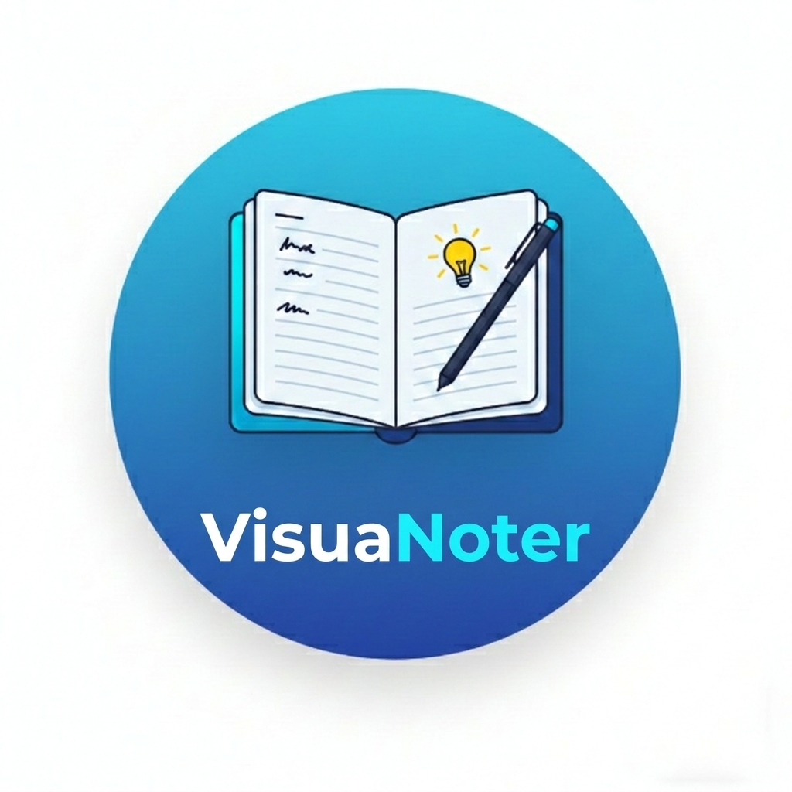

# 📓 VisuaNoter

<p align="center">
  
  <br>
  <b>Organização Visual e Gestão Inteligente de Notas</b>
  <br>
  <br>
  
  
  
  
</p>

**VisuaNoter** é um aplicativo desktop moderno desenvolvido para transformar a maneira como você captura ideias. Ele combina a flexibilidade do Vue 3 com o poder do Electron para oferecer uma experiência nativa de alta performance, focada em produtividade e organização visual.

---

## ✨ Funcionalidades Principais

- **📝 Gestão de Notas Completa:** Crie, edite e organize notas com uma interface intuitiva.
- **🎨 Categorização Visual:** Utilize uma paleta de cores e tags para identificar instantaneamente diferentes tipos de conteúdo.
- **📌 Notas Fixadas:** Mantenha as informações mais importantes sempre no topo da sua lista.
- **🔔 Lembretes Ativos:** Configure alarmes com notificações nativas que garantem o cumprimento de prazos.
- **💾 Backup Silencioso:** Sistema de backup automático para pastas locais, garantindo a segurança dos seus dados sem interromper seu fluxo de trabalho.
- **🌓 Temas Dinâmicos:** Suporte a múltiplos temas (Dark, Light, Cyberpunk, etc.) que se adaptam à sua preferência ou ao sistema.
- **🌍 Internacionalização:** Interface totalmente traduzida para Português (PT-BR) e Inglês (EN-US).

---

## ⌨️ Atalhos de Teclado

Aumente sua produtividade utilizando os atalhos implementados no sistema:

| Atalho     | Ação                                    |
| :--------- | :-------------------------------------- |
| `Ctrl + N` | Criar uma nova nota rapidamente         |
| `Ctrl + F` | Focar no campo de busca de notas        |
| `Ctrl + S` | Salvar nota (dentro do modal de edição) |
| `Ctrl + ,` | Abrir configurações de Backup e Sistema |
| `Esc`      | Fechar modais de leitura ou edição      |

---

## 🚀 Como Executar o Projeto

### Pré-requisitos

- [Node.js](https://nodejs.org/) (v16.x ou superior)
- npm

### Instalação e Execução

1.  **Clone o repositório:**
    ```bash
    git clone https://github.com/hugoalvessiq/visuanoter-desktop.git
    cd visuanoter-desktop
    ```
2.  **Instale as dependências:**
    ```bash
    npm install
    ```
3.  **Primeiro inicie o ambiente de desenvolvimento:**
    ```bash
    npm run dev
    ```
3.  **Após inicie o Electron:**
    ```bash
    npm run electron:dev
    ```

### Build (Gerar Executável)

Para compilar o aplicativo para produção:

```bash
npm run build
```

---

## 📁 Estrutura do Projeto

```text
├── electron/          # Processo principal e preload do Electron
├── public/            # Ativos estáticos para build
├── src/
│   ├── assets/        # Estilos globais e recursos visuais
│   ├── components/    # Componentes modulares Vue (Cards, Modais)
│   ├── store/         # Gerenciamento de estado (noteStore)
│   └── App.vue        # Ponto de entrada da interface
└── vite.config.js     # Configurações do Vite

```

---

## 🤝 Contribuição

1. Faça um **Fork** do projeto.
2. Crie uma **Branch** para sua modificação (`git checkout -b feature/NovaFuncionalidade`).
3. Efetue o **Commit** (`git commit -m 'Adiciona nova funcionalidade'`).
4. Dê um **Push** na Branch (`git push origin feature/NovaFuncionalidade`).
5. Abra um **Pull Request**.

---

## 📄 Licença

Este projeto está sob a licença MIT. Veja o arquivo [LICENSE](./LICENSE) para mais detalhes.

<p align="left">
Desenvolvido por <a href="https://github.com/hugoalvessiq">Hugo</a>
</p>
